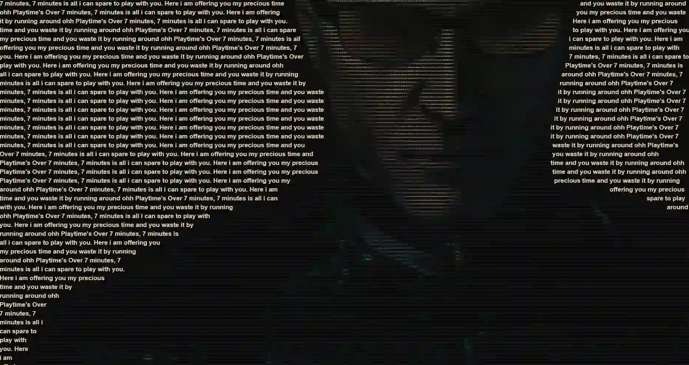

# 🎨 Wrap-Text Studio

**Wrap-Text Studio** is a WebGL creative tool that masks and wraps typography around video silhouettes in real-time.



## ✨ Core Technology: Pretext

This project is powered by [**@chenglou/pretext**](https://github.com/chenglou/pretext), a high-performance text layout engine that enables complex character-level alignment and wrapping. It is used here to calculate the flow of text around dynamically generated silhouette paths from the video source.

## ✨ Features

- **Typographic Wrapping**: Wraps text around video subjects using the Pretext engine.
- **WebGL ASCII Engine**: GLSL-powered mapping of video luminance to characters.
- **Modes**: ASCII, Grayscale, and Silhouette Masking.
- **Export**: WebM video export with audio via WebCodecs.
- **GIF Support**: Imports and processes GIF animations natively.

## 🚀 Tech Stack

- **Core**: TypeScript, HTML5, Vanilla CSS
- **Graphics**: WebGL (GLSL Shaders), Canvas API
- **Text Layout**: [@chenglou/pretext](https://github.com/chenglou/pretext)
- **Video Processing**: WebCodecs API, WebM Muxer
- **Build Tool**: Vite

## 🛠️ Getting Started

### Prerequisites

- [Node.js](https://nodejs.org/) (v18+ recommended)
- [Yarn](https://yarnpkg.com/) or npm

### Installation

1. Clone the repository:

   ```bash
   git clone https://github.com/GreaZeY/wrap-text-studio.git
   cd wrap-text-studio
   ```

2. Install dependencies:
   ```bash
   yarn install
   # or
   npm install
   ```

### Development

Start the local development server:

```bash
yarn dev
```

### Build

```bash
yarn build
```

## 📖 Usage

1. **Import Media**: Drag and drop a video or GIF (high contrast/solid backgrounds work best).
2. **Set the Story**: Paste your text into the "Story" panel.
3. **Customize Style**: Use the "Visual Mode" dropdown to switch between ASCII, Original, or Grayscale.
4. **Refine Typography**: Adjust the Font Family, Size, and Spacing until the wrap fits perfectly.
5. **Export**: Click the download icon to generate a high-quality WebM file of your creation.

---
